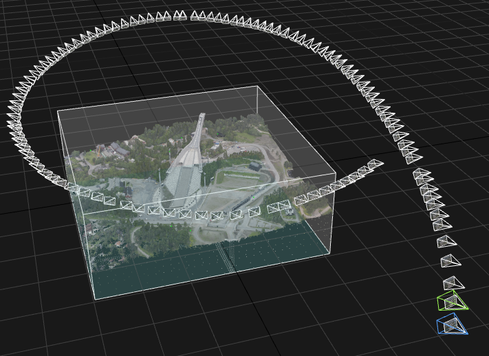

# Lab: Pose and camera geometry
In this lab we will experiment with poses in different coordinate frames together with the perspective camera model, using real data taken from a helicopter flying around Holmenkollen.

Start by cloning this repository on your machine. 
Then open the lab project in CLion.

The lab is carried out by following these steps:
1. [Get an overview](lab-guide/1-get-an-overview.md)
2. [From geographical coordinates to pixels](lab-guide/2-from-geographical-coordinates-to-pixels.md)

You will find our proposed solution at https://github.com/tek5030/solution-camera-pose.
Please try to solve the lab with help from others instead of just jumping straight to the solution ;)

Please start the lab by going to the [first step](lab-guide/1-get-an-overview.md).