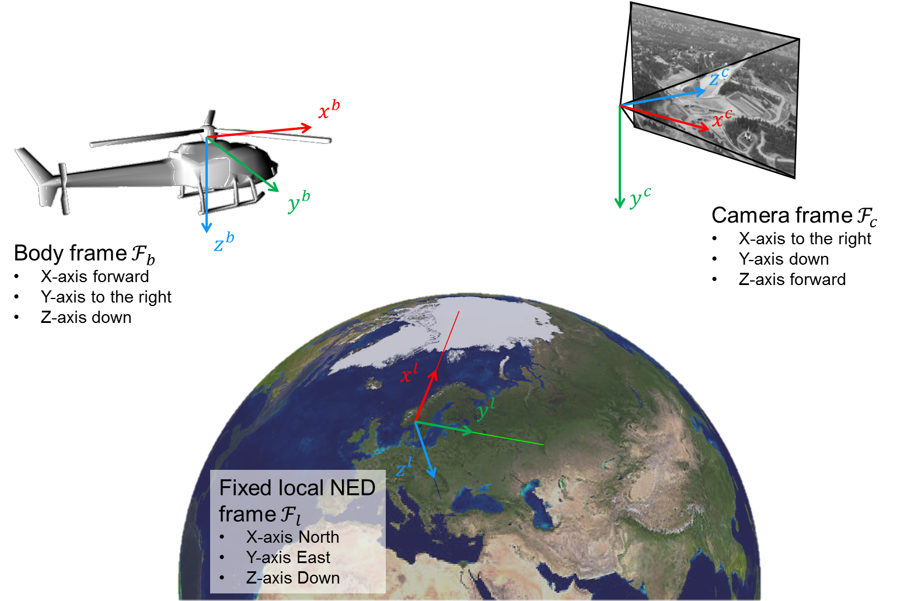
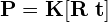

# Step 2: From geographical coordinates to pixels
Now, lets compute the connection between geographical coordinates and image pixels using real data!

## The Sophus library
We will use [Sophus](https://github.com/strasdat/Sophus) to represent poses and orientations. 
It lets us perform operations on SO(3) and SE(3) matrix Lie groups with Eigen. 
Take a look at [so3.hpp](https://github.com/strasdat/Sophus/blob/master/sophus/so3.hpp) and [se3.hpp](https://github.com/strasdat/Sophus/blob/master/sophus/se3.hpp) for documentation. 
Ask the instructors when you have questions about Sophus!

## Coordinate systems
In [lab_5.cpp:20](https://github.com/tek5030/lab_05/blob/master/lab_5.cpp#L20), we are given the geodetic position of a light pole:

We will create a local Cartesian NED coordinate system around this position using `LocalCoordinateSystem`. 
The helicopter (body) navigation data is given as a set of [geodetic positions](https://en.wikipedia.org/wiki/Geographic_coordinate_system) with the corresponding [NED attitude](https://en.wikipedia.org/wiki/Axes_conventions#Ground_reference_frames:_ENU_and_NED). 
The `LocalCoordinateSystem` class lets us convert navigation data to poses in the local coordinate system *Fl*.

Take a look at the documentation in [local_coordinate_system.h](https://github.com/tek5030/lab_05/blob/master/local_coordinate_system.h).

With `LocalCoordinateSystem`, we are able to represent the poses of the helicopter *Fb* in a common Cartesian coordinate system *Fl*.

The camera  pose measurements in *Fc* are represented as Cartesian positions with corresponding NED attitudes relative to the body frame *Fb*.

For each image, we are given these data in `DataElement`. 
Take a look at `DataElement` in [dataset.h](https://github.com/tek5030/lab_05/blob/master/dataset.h).
Then, get an overview of the data structures in [attitude.h](https://github.com/tek5030/lab_05/blob/master/attitude.h), [geodetic_position.h](https://github.com/tek5030/lab_05/blob/master/geodetic_position.h) and [cartesian_position.h](https://github.com/tek5030/lab_05/blob/master/cartesian_position.h).

## 1. Convert geographical body position and attitude to local Cartesian pose
The first step is to convert the navigation data to the poses **T***lb* (pose of *Fb* relative to *Fl*). 
To accomplish this, we need to convert the orientation from roll-pitch-yaw Euler angles (*&theta;1*, *&theta;2*, *&theta;3*) to a proper rotation matrix:

You will need to finish the `Attitude::toQuaternion` member function in [attitude.cpp](https://github.com/tek5030/lab_05/blob/master/attitude.cpp#L4), which is used by `Attitude::toSO3` to return a `Sophus::SO3d` orientation.
1. Convert attitude in Euler angles (roll-pitch-yaw) to a Quaternion. 
   Use `Eigen::AngleAxisd`, which lets us [create principal rotations, combine them and return quaternions](http://eigen.tuxfamily.org/dox/classEigen_1_1AngleAxis.html).
2. Add body axes to the 3D viewer in [lab_5.cpp](https://github.com/tek5030/lab_05/blob/master/lab_5.cpp#L36) using [`Viewer3D::addBodyAxes`](https://github.com/tek5030/lab_05/blob/master/viewer_3d.h#L13).
   Use the image number provided by the data element.
3. Compile and run. 
   You should see the body axes for each image.
   Does the result look reasonable?

## 2. Compute the pose of the camera
The next step is to convert the camera pose measurements to poses **T***lc* (pose of *Fc* relative to *Fl*).

You will need to finish `CartesianPosition::toVector` to return a translation vector between *Fb* and *Fc*. 
You can then use this translation and the corresponding SO(3) orientation from the camera's attitude to compute the SE(3) pose **T***bc*. 
This will let you compute and visualize the pose **T***lc*.

1. Convert the Cartesian position to a translation vector between *Fb* and *Fc* by finishing `CartesianPosition::toVector` in [cartesian_position.cpp](https://github.com/tek5030/lab_05/blob/master/cartesian_position.cpp#L3).
2. Construct the pose **T***bc* in the body coordinate system in [lab_5.cpp](https://github.com/tek5030/lab_05/blob/master/lab_5.cpp#L42).
3. Compute the pose **T***lc* in the local coordinate system in [lab_5.cpp](https://github.com/tek5030/lab_05/blob/master/lab_5.cpp#L46).
4. Add the camera axes to the 3D viewer in [lab_5.cpp](https://github.com/tek5030/lab_05/blob/master/lab_5.cpp#L50) using [`Viewer3D::addCameraAxes`](https://github.com/tek5030/lab_05/blob/master/viewer_3d.h#L14).
5. Compile and run. 
   You should see the smaller camera axes together with the body axes for each image. 
   Does the result look reasonable?

## 3. Undistort the images
Before we can project world points into the images, we need to undistort them.
Why?

The calibration parameters have been read into `Intrinsics` objects. 
To use them, we need to finish `Intrinsics::toCalibrationMatrix` to return the camera calibration matrix **K** and `Intrinsics::toDistortionVector` to return an [OpenCV distortion coefficient vector](https://docs.opencv.org/4.0.1/d9/d0c/group__calib3d.html).
We can then undistort the image using `PerspectiveCameraModel`.
Take a look at the documentation in [perspective_camera_model.h](https://github.com/tek5030/lab_05/blob/master/perspective_camera_model.h).

1. Finish `Intrinsics::toCalibrationMatrix` in [intrinsics.cpp](https://github.com/tek5030/lab_05/blob/master/intrinsics.cpp#L3).
2. Finish `Intrinsics::toDistortionVector` in [intrinsics.cpp](https://github.com/tek5030/lab_05/blob/master/intrinsics.cpp#L9). 
   You should return a vector on the form [*k*1, *k*2, 0, 0, *k*3], where *k**i* are the different radial distortion parameters.
3. Use the camera model to undistort the image in [lab_5.cpp](https://github.com/tek5030/lab_05/blob/master/lab_5.cpp#L61).
4. Compile and run. 
   You will probably not notice any significant changes to the images, but if they still look reasonable, we are ready to continue!

## 4. Project a geographic world point into the images
We are now ready to project the position of the light pole into each image. 
Remember that the light pole is at the origin in the local coordinate system *Fl*.

First, we need to compute the camera projection matrix

in `PerspectiveCameraModel::computeCameraProjectionMatrix`. 

Make certain that you are using the correct pose when you extract **R** and **t**. 
You might be interested in the [`se3::matrix3x4`](https://github.com/strasdat/Sophus/blob/26c200265e2eb3d76e5ab00a99ada686d6a80d15/sophus/se3.hpp#L282) member function.

We can then use the camera projection matrix to implement the perspective camera projection function in `PerspectiveCameraModel::projectWorldPoint`. 
Remember to use the homogenous representations in Eigen.

1. Finish `PerspectiveCameraModel::computeCameraProjectionMatrix` in [perspective_camera_model.cpp](https://github.com/tek5030/lab_05/blob/master/perspective_camera_model.cpp#L31).
2. Finish `PerspectiveCameraModel::projectWorldPoint` in [perspective_camera_model.cpp](https://github.com/tek5030/lab_05/blob/master/perspective_camera_model.cpp#L39).
3. Add the camera frustum to the 3D viewer using [`Viewer3D::addCameraFrustum`](https://github.com/tek5030/lab_05/blob/master/viewer_3d.h#L15) in [lab_5.cpp](https://github.com/tek5030/lab_05/blob/master/lab_5.cpp#L75).
4. Compile and run. 
   Does the camera frustums look reasonable? 
   Is the light pole projected correctly into the images?
   
Congratulations! 
You have now established the connection between geographical coordinates and image pixels using the power of imaging geometry! 
Cool, right?

## Extra
- Finish [`PerspectiveCameraModel::projectWorldPoints`](https://github.com/tek5030/lab_05/blob/master/perspective_camera_model.cpp#L45) and project other geographical points into the images (see www.norgeskart.no).
- Create a virtual camera and project points into this camera.
